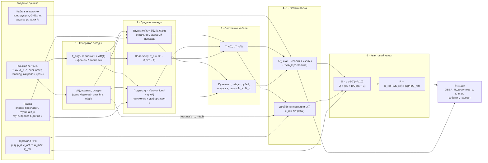

# Модель влияния внешних воздействий на оптический сегмент МУКС

**Объект:** оптическое плечо между двумя терминалами КРК межуниверситетской квантовой сети (МУКС).
**Реализация:** интерактивный симулятор `muks-simulator/index.html`.
**Выходы модели:** температура кабеля, затухание плеча, QBER, скорость секретного ключа, доступность канала, критические интервалы и параметры паспорта сегмента.

---

## 1. Структура модели

Модель состоит из шести последовательно связанных подмоделей разной природы. Каждая передаёт следующей физическую величину во времени (шаг расчёта — 1 ч):

1. стохастический генератор метеорологических рядов;
2. модель среды прокладки — теплоперенос в грунте, механика подвеса или коллектор;
3. модель механического и ледового состояния кабеля;
4. модель затухания оптического плеча;
5. модель поляризационной динамики;
6. модель квантового канала (QBER и скорость ключа).

**Таблица 1.** Подмодели и их основания.

| Подмодель | Класс модели | Основное уравнение | Основание |
|---|---|---|---|
| Погода | Стохастическая | Гармоники + AR(1), процессы Пуассона и Маркова | Климатические нормы; ERA5-Land [20] |
| Грунт | Детерминированная, физическая | Уравнение теплопроводности в энтальпийной форме | [13–16] |
| Подвес | Инженерная механика | Гололёдно-ветровая нагрузка, упругая нить | [11, 12] |
| Состояние кабеля | Феноменологическая, с релаксацией | Уравнения релаксации первого порядка | [17–19] |
| Затухание | Полуэмпирическая | Аддитивный бюджет потерь, модель изгиба Маркузе | [1–7] |
| Поляризация | Геометрическая (сфера Пуанкаре) | $e_d = \sin^2(\theta/2)$ | [9, 10] |
| Квантовый канал | Модель слабых отсчётов, асимптотика BB84 | $Q = (eS + B/2)/(S+B)$ | [21–26] |

---

## 2. Генератор метеорологических рядов

### 2.1. Температура воздуха

$$
T_{air}(t) = \bar T + A_a\,s(t) + A_d\cos\!\left(\frac{2\pi(h-15)}{24}\right)\big(1+0{,}25\,s(t)\big) + \sigma\big(1-0{,}3\,s(t)\big)\,x(t) + \beta\,\frac{t}{3652{,}5} + \Delta T_{mode}(t),
$$

$$
s(t)=\cos\!\left(\frac{2\pi(d(t)-201)}{365{,}25}\right),
$$

где $\bar T$ — среднегодовая температура; $A_a$ — годовая полуамплитуда; $A_d$ — суточная амплитуда (максимум в 15:00); $d$ — номер суток года (максимум около 20 июля); $h$ — час суток; $\beta$ — климатический тренд, °C за 10 лет; $t$ — время в сутках.

Синоптическая изменчивость задаётся процессом AR(1) с временем корреляции 72 ч:

$$
x_{n+1} = \varphi x_n + \sqrt{1-\varphi^2}\,\xi_n,\qquad \varphi = e^{-1/72},\quad \xi_n\sim\mathcal N(0,1).
$$

Режимы колебаний $\Delta T_{mode}$:

| Режим | Формула |
|---|---|
| Сезонный цикл | $\sigma = 0$ |
| Случайная погода | базовая формула |
| Резкие перепады | $0{,}5\sigma x(t) + \sum_k a_k\,\Pi(t;c_k,d_k)$; число фронтов — пуассоновское с интенсивностью $\lambda_f$ в месяц; $d_k\in[1,4]$ сут; $a_k = A_f(0{,}6+0{,}4u)$; знак «+» с вероятностью 0,62 зимой и 0,5 летом |
| Линейное изменение | $T_0 + (T_1-T_0)\,t/t_{end}$ + суточный ход |
| Аномальная волна | $\Delta T\,\Pi(t;t_0,D)$ |
| Пользовательский ряд | линейная интерполяция на часовую сетку; суточные ряды дополняются суточным ходом |

Функция плато со сглаженными фронтами:

$$
\Pi(t;c,d,w) = \tfrac12\left[\tanh\frac{t-c}{w} - \tanh\frac{t-c-d}{w}\right].
$$

### 2.2. Ветер, осадки, снег, гололёд

Средняя скорость ветра:

$$
V(t) = \bar V\,\big(1-0{,}15\,s\big)\,\max\big(0{,}08,\;1+0{,}5\,x_w\big)\,S_f(t),\qquad V_g = 1{,}45V + 1,
$$

где $x_w$ — процесс AR(1) с временем корреляции 8 ч. $S_f$ — множитель штормов: поток Пуассона, длительность 6–24 ч, усиление в 1,8–2,6 раза.

**Осадки** — двухсостояная цепь Маркова с вероятностями переходов $P_{01}=0{,}035$ ч⁻¹ и $P_{10}=0{,}14$ ч⁻¹.

**Снежный покров:**

$$
h_s \leftarrow h_s + 0{,}012\,(1{,}1h_{max}-h_s)\ \big[\text{осадки},\ T<0{,}5\big],\qquad
h_s \leftarrow 0{,}99985\,h_s - 0{,}07\,T\,(1+\text{осадки})\ \big[T>0\big].
$$

**Гололёд** (мм). Нарастание происходит при осадках и $-6\le T\le 0{,}5$ °C с вероятностью 0,35 в час:

$$
\Delta b = 0{,}8\,k_{reg}\ \text{мм/ч},\qquad k_{reg}\in\{0{,}5;\,0{,}75;\,1;\,1{,}3;\,1{,}6\}\ \text{для районов I–V}.
$$

Таяние: $-(0{,}25T+0{,}05)$ при $T>0{,}5$; сброс ветром: $-0{,}15$ при $V_g>15$ м/с. Толщина ограничена $1{,}6\,b_d$, где $b_d = 10\ldots30$ мм — нормативная толщина стенки гололёда района [11].

---

## 3. Теплоперенос в грунте

### 3.1. Уравнение и замыкание

Одномерная задача Стефана решается энтальпийным методом [13, 14]:

$$
\frac{\partial H}{\partial t} = \frac{\partial}{\partial z}\left(k(T)\frac{\partial T}{\partial z}\right),\qquad 0\le z\le 8\ \text{м}.
$$

Объёмная энтальпия с интервалом фазового перехода $\Delta T_f = 1$ K:

$$
H(T)=\begin{cases}
C\,T, & T\le-\Delta T_f,\\[2pt]
C\,T + L_w\dfrac{T+\Delta T_f}{\Delta T_f}, & -\Delta T_f<T\le 0,\\[6pt]
C\,T + L_w, & T>0,
\end{cases}
\qquad L_w = 334\cdot10^{6}\,\theta_w\ \text{Дж/м}^3.
$$

Доля жидкой воды и теплопроводность:

$$
\phi_l = \mathrm{clip}\!\left(\frac{T+\Delta T_f}{\Delta T_f},0,1\right),\qquad
k(T) = k_f + (k_u-k_f)\,\phi_l,\qquad k_f = k_u(1+0{,}8\,\theta_w).
$$

**Дискретизация:** явная конечно-объёмная схема, $\Delta z = 0{,}1$ м, 81 узел; шаг по времени $\Delta t \le 0{,}45\,\Delta z^2 C/k_{max}$ (условие устойчивости).

### 3.2. Граничные и начальные условия

Температура поверхности учитывает теплоизоляцию снегом [15]:

$$
T_s=\begin{cases}
T_{air}\,e^{-h_s/25}, & h_s>1\ \text{см},\ T_{air}<0,\\
0, & h_s>1\ \text{см},\ T_{air}\ge0\ (\text{таяние}),\\
T_{air}+1{,}5, & h_s\le1\ \text{см},\ T_{air}>0,\\
T_{air}, & \text{иначе}.
\end{cases}
$$

Нижняя граница: $T(8\ \text{м}) = \langle T_s\rangle + 0{,}2$ °C (среднегодовая температура поверхности плюс геотермический градиент).

**Начальное состояние:** однородный профиль $T=\langle T_s\rangle$, затем три года «разгона» на независимой реализации той же климатической нормы без тренда и аномалий. Максимальная глубина протаивания за разгон $z_{t,0}$ — опорный уровень для расчёта осадки.

**Проверочный случай** — однородное полупространство без фазового перехода с гармоническим граничным условием [16]:

$$
T(z,t)=\bar T + A_0 e^{-z/\delta_P}\cos\!\left(\frac{2\pi t}{P}-\frac{z}{\delta_P}\right),\qquad \delta_P=\sqrt{\frac{\kappa P}{\pi}},\quad \kappa = \frac{k}{C}.
$$

### 3.3. Параметры грунтов

**Таблица 2.**

| Грунт | $k_u$, Вт/(м·К) | $C$, МДж/(м³·К) | $\theta_w$ | $\eta_h$ (пучинистость) | $i_{ice}$ (льдистость) | Осадка, м/год |
|---|---:|---:|---:|---:|---:|---:|
| Суглинок | 1,3 | 2,4 | 0,30 | 0,70 | 0 | 0 |
| Глина | 1,1 | 2,7 | 0,38 | 0,85 | 0 | 0 |
| Песок влажный | 1,9 | 2,5 | 0,22 | 0,20 | 0 | 0 |
| Песок сухой | 0,35 | 1,4 | 0,05 | 0,05 | 0 | 0 |
| Торф водонасыщенный | 0,45 | 3,4 | 0,75 | 0,50 | 0 | 0,02 |
| Скальный | 2,8 | 2,1 | 0,02 | 0 | 0 | 0 |
| Льдистый мёрзлый (ММП) | 1,6 | 2,2 | 0,40 | 0,60 | 0,8 | 0 |

**Диагностируемые величины:**
- температура кабеля $T_c$ — линейная интерполяция профиля на глубину $z_c$;
- глубина промерзания $z_f$ — нижняя граница мёрзлого слоя от поверхности ($\phi_l<0{,}5$);
- глубина протаивания $z_t$ — верхняя граница мёрзлого слоя под талым.

---

## 4. Подвесные линии и коллекторы

### 4.1. Нагрузка и натяжение подвеса

Погонные нагрузки на кабель диаметром $D$ с гололёдом толщиной $b$ [11, 12]:

$$
w_{ice} = \rho_{ice}\,g\,\pi\,b\,(b+D),\qquad
q_w = \tfrac12\rho_{air}C_D\,(D+2b)\,V_g^2,\qquad
q = \sqrt{(w+w_{ice})^2 + q_w^2},
$$

где $\rho_{ice}=900$ кг/м³, $\rho_{air}=1{,}225$ кг/м³, $C_D = 1{,}1$.

Расчётная нагрузка — максимум из двух режимов: «ветер 29 м/с без гололёда» и «нормативный гололёд $b_d$ при ветре 14,5 м/с»:

$$
q_d = \max\left\{\sqrt{w^2+q_w(29,D)^2},\ \sqrt{(w+w_{ice}(b_d))^2+q_w(14{,}5,\,D+2b_d)^2}\right\}.
$$

Для упругой нити натяжение $H\propto (q\ell)^{2/3}$, отсюда относительное натяжение и деформация кабеля:

$$
r = \left(\frac{q}{q_d}\right)^{2/3}\left(\frac{\ell}{\ell_d}\right)^{2/3},\qquad \varepsilon = 0{,}25\,r\ \ [\%],
$$

где $\ell_d$ — расчётный пролёт: 70 м для ADSS, 250 м для ОКГТ.

### 4.2. Температура кабеля в подвесе и в коллекторе

Подвес — нагрев солнечной радиацией с ослаблением ветром:

$$
T_c = T_{air} + \big(3+5\max(0,\tfrac{s+0{,}3}{1{,}3})\big)\max\!\big(0,\cos\tfrac{2\pi(h-13)}{24}\big)\frac{\gamma_{cl}}{1+V/4} + \Delta T_{J},
$$

где $\gamma_{cl}=0{,}3$ при осадках и 1 без них; $\Delta T_J = 2$ K для ОКГТ (нагрев током линии).

Коллектор — экспоненциальное сглаживание с постоянной времени 240 ч:

$$
T_c = 12 + 0{,}3\,(\tilde T_{air} - \bar T).
$$

---

## 5. Состояние кабеля

**Морозное пучение** — индекс $h\in[0,\eta_h]$, релаксирующий к равновесию, которое задаётся промерзанием грунта на глубине кабеля [17, 18]:

$$
\frac{dh}{dt} = \frac{h^* - h}{\tau_h},\qquad h^* = \eta_h\big(1-\phi_l(T_c)\big),\qquad \tau_h=\begin{cases}72\ \text{ч}, & h^*>h,\\ 240\ \text{ч}, & h^*\le h.\end{cases}
$$

**Циклы промерзания–оттаивания** у кабеля $N_{fc}$ считаются с гистерезисом: переход в мёрзлое состояние при $\phi_l<0{,}3$, выход при $\phi_l>0{,}7$.

**Термоциклы кабеля** $N_{tc}$ — число переходов $T_c$ через порог микроизгиба конструкции $T_{th}\pm1$ K [7].

**Лёд в кабельной канализации** (доля заполнения $I\in[0,1]$):

$$
\frac{dI}{dt} = \begin{cases}(1-I)/48\ \text{ч}, & T_c<-0{,}3\ ^\circ\text{C},\\ -I/24\ \text{ч}, & T_c>0{,}2\ ^\circ\text{C}.\end{cases}
$$

**Осадка при протаивании льдистого грунта** [19]:

$$
\Delta s = 0{,}2\,i_{ice}\,(z_t - z_{t,max})\quad \text{при}\ z_t>z_{t,max},\ z_t>z_c-0{,}3,
$$

где $z_{t,max}$ — наибольшая достигнутая глубина протаивания; для торфа добавляется постоянная скорость консолидации.

---

## 6. Затухание оптического плеча

### 6.1. Бюджет потерь

$$
A(t) = \underbrace{\alpha L + N_m\ell_s + \ell_c + A_{bend}}_{A_0} + \Delta A_T + \Delta A_F + \Delta A_D + \Delta A_I + \Delta A_S,
$$

где:
- $N_m=\lceil L/\ell_b\rceil-1$ — число муфт при строительной длине $\ell_b$;
- $\ell_s$ — потери на одну сварку;
- $\ell_c = 0{,}5$ дБ — два соединителя;
- $N_h = n_h L$ — число неоднородностей трассы (переходы грунта, пересечения, колодцы);
- $m_f$ — микроизгибная чувствительность волокна (табл. 3);
- $c = c_{cab}\,c_{inst}$ — коэффициент передачи деформаций грунта кабелю: 1,0 в грунте, 0,5 в канализации, 0 в подвесе и коллекторе.

### 6.2. Макроизгибные потери

Экспоненциальная зависимость потерь на виток от радиуса изгиба [5] аппроксимирована по двум нормативным точкам $(R_1,\ell_1)$, $(R_2,\ell_2)$ каждой категории волокна [1–3]:

$$
\ell_{turn}(R) = \ell_1\,e^{-k(R-R_1)},\qquad k=\frac{\ln(\ell_1/\ell_2)}{R_2-R_1},\qquad
A_{bend} = \ell_{turn}(R)\,n_{turns}\,(N_m+2).
$$

**Таблица 3.** Параметры волокон (1550 нм).

| Категория | $\alpha$, дБ/км | $m_f$ | Точки изгиба $(R,\ \ell_{turn})$ | ПМП, мкм |
|---|---:|---:|---|---:|
| G.652.D | 0,20 | 1,0 | (30 мм; 0,0005 дБ), (15 мм; 0,5 дБ) | 9,2 |
| G.657.A1 | 0,20 | 0,7 | (10; 0,75), (15; 0,025) | 8,8 |
| G.657.A2 | 0,20 | 0,5 | (7,5; 0,5), (15; 0,003) | 8,6 |
| G.657.B3 | 0,21 | 0,35 | (5; 0,15), (15; 0,003) | 8,6 |
| G.654.E | 0,17 | 1,6 | (30; 0,001), (15; 1,5) | 12,5 |
| G.655 | 0,21 | 1,1 | (30; 0,0005), (15; 0,6) | 9,6 |

### 6.3. Добавочные потери от воздействий

**Температурный микроизгиб.** Возникает из-за различия коэффициентов теплового расширения волокна и полимерных элементов конструкции [6, 7]:

$$
\Delta A_T = L\,s_\mu\,m_f\,g^2,\quad g=\frac{T_{th}-T_c}{T_{th}+40}\ \ (T_c<T_{th});
$$

$$
+\,0{,}01\,L\,m_f\left(\frac{T_{min}-T_c}{5}\right)^2\ (T_c<T_{min}),\qquad
+\,0{,}005\,L\,m_f\left(\frac{T_c-T_{max}}{5}\right)^2\ (T_c>T_{max}).
$$

Параметр $s_\mu$ — прирост затухания конструкции при −40 °C, дБ/км.

**Пучение, лёд в трубе, натяжение:**

$$
\Delta A_F = 0{,}3\,N_h\,h\,m_f\,c,\qquad
\Delta A_D = 0{,}0525\,L\,w_d\,I\,m_f,\qquad
\Delta A_S = 0{,}01\,L\,m_f\left(\frac{\varepsilon-\varepsilon_w}{0{,}1}\right)^2\ (\varepsilon>\varepsilon_w),
$$

где $w_d\in\{0;\,0{,}3;\,1\}$ — заполнение канализации водой; $\varepsilon_w$ — окно свободной деформации волокна в конструкции.

**Необратимые изменения** — осадка, остаточная деформация после циклов пучения и гистерезис термоциклов [7, 8]:

$$
\Delta A_I = 0{,}4\,N_h\,m_f\,c\,\tanh\frac{s}{0{,}05} + 0{,}02\,N_h\,N_{fc}\,\eta_h\,m_f\,c + 0{,}004\,L\,m_f\frac{s_\mu}{0{,}015}\left(1-e^{-N_{tc}/200}\right).
$$

**Таблица 4.** Параметры конструкций кабеля.

| Конструкция | $s_\mu$, дБ/км | $T_{th}$, °C | $T_{min}\ldots T_{max}$, °C | $c_{cab}$ | $D$, мм | $w$, Н/м | $\varepsilon_w$, % |
|---|---:|---:|---|---:|---:|---:|---:|
| ОКБ (броня из проволок) | 0,012 | −10 | −40…+60 | 1,0 | 16 | 3,2 | 0,30 |
| ОКЛ (гофрированная лента) | 0,015 | −10 | −40…+60 | 0,8 | 12 | 1,6 | 0,30 |
| ОКСН / ADSS | 0,015 | −15 | −60…+70 [27] | 0,6 | 12,5 | 1,3 | 0,30 |
| ОКГТ / OPGW | 0,008 | −20 | −60…+85 [28] | 0,3 | 8,2 | 3,0 | 0,40 |
| Плотный буфер | 0,06 | 0 | −20…+60 | 1,3 | 6 | 0,4 | 0,05 |

---

## 7. Поляризационная динамика

Скорость дрейфа состояния поляризации (SOP) на сфере Пуанкаре складывается из трёх источников, заданных на 1 км волокна [9, 10]:

$$
\omega = p\,L\,(\omega_T + \omega_R + \omega_W),
$$

$$
\omega_T = 0{,}05\,\frac{|dT_c/dt|}{3600},\qquad
\omega_R = 0{,}02\,\frac{N_{tr}}{24}\,k_{day}\,k_{inst},\qquad
\omega_W = 0{,}002\,V_g^2\sqrt{\ell/\ell_d}\,\left(1+\frac{b}{10}\right)k_{sop}\quad [\text{рад/(с·км)}].
$$

Здесь:
- $\omega_T$ — температурный дрейф;
- $\omega_R$ — вибрации от поездов ($N_{tr}$ поездов в сутки; $k_{day}=1{,}2$ днём и 0,5 ночью; $k_{inst}$ = 0,3 для грунта, 0,2 для канализации, 1,0 для ADSS, 0,3 для ОКГТ, 0,1 для коллектора);
- $\omega_W$ — колебания подвеса под ветром ($k_{sop}=1$ для ADSS, 0,5 для ОКГТ);
- $p$ — чувствительность терминала к дрейфу поляризации.

Система подстройки с временем реакции $\tau$ накапливает угол рассогласования $\theta$. Проекция дрейфа на измерительный базис даёт ошибку:

$$
\theta = \min(\omega\tau,\ \pi/2),\qquad e_d = \sin^2(\theta/2).
$$

Удары молнии в линию моделируются потоком Пуассона с интенсивностью, пропорциональной числу грозовых дней, длине плеча и летнему дневному весу. Для ОКГТ удар даёт кратковременный скачок SOP со скоростью до Мрад/с [10].

---

## 8. Модель квантового канала

### 8.1. Регистрации и QBER

Вероятности полезной и фоновой регистрации на один импульс [21, 23]:

$$
S = \mu\,\eta\,10^{-A/10},\qquad B = 2p_d + p_R,
$$

где $p_d$ — темновые отсчёты на строб одного детектора. Рамановский шум совместно распространяющегося классического канала мощностью $P$ [26]:

$$
p_R = 2\cdot10^{-6}\,P_{\text{мВт}}\,L\,10^{-\alpha L/10}.
$$

Ошибка полезных отсчётов — композиция независимых ошибок оптики терминала и подстройки поляризации:

$$
e = e_{opt} + e_d\,(1-2e_{opt}).
$$

QBER при равновероятных ошибках фоновых отсчётов:

$$
Q = \frac{e\,S + \tfrac12 B}{S+B}.
$$

### 8.2. Скорость секретного ключа

Доля секретного ключа в асимптотическом пределе BB84 с неидеальной коррекцией ошибок [22, 24, 25]:

$$
F(Q) = 1 - h(Q) - f_{EC}\,h(Q),\qquad h(x) = -x\log_2x-(1-x)\log_2(1-x),\qquad f_{EC}=1{,}16.
$$

Скорость нормируется на опорную точку терминала $R_{ref}$ при потерях 10 дБ [29]:

$$
R = R_{ref}\,\frac{S}{S_{ref}}\,\frac{F(Q)}{F(Q_{ref})},\qquad S_{ref}=0{,}1\,\mu\eta,\qquad Q_{ref}=\frac{e_{opt}S_{ref}+p_d}{S_{ref}+2p_d}.
$$

Частота регистраций: $f_{rep}(S+B)$.

### 8.3. Профили терминалов

**Таблица 5.**

| Параметр | Профиль A (фазовое кодирование) | Профиль B (поднесущие частоты, SCW) |
|---|---:|---:|
| $\mu$ | 0,20 | 0,25 |
| $f_{rep}$, МГц | 100 | 100 |
| $\eta$, % | 10 | 10 |
| $p_d$, 10⁻⁶ | 5 | 10 |
| $e_{opt}$, % | 1,0 | 1,5 |
| $\tau$, мс | 5 | 5 |
| $p$ | 1,0 | 0,6 |
| $A_{max}$, дБ | 20 | 20 [29] |
| $Q_{thr}$, % | 6 | 6 |
| $R_{ref}$ при 10 дБ, бит/с | 1000 | 700 [29] |

Протокол на поднесущих частотах описан в [25], архитектура ИнфоТеКС — в [30].

---

## 9. Критерии оценки и паспорт сегмента

**Доступность канала** — доля часов, в которые одновременно выполнены условия $Q\le Q_{thr}$, $A\le A_{max}$ и $R>0$.

**Остаток бюджета потерь:**

$$
M = \min_t\big(A_{max} - A_{res} - A(t)\big),
$$

где $A_{res}$ — эксплуатационный запас.

**Максимальная длина плеча** $L_{max}$ — наибольшая длина, при которой на всём периоде выполняются $A(t)+A_{res}\le A_{max}$ и $Q(t)\le Q_{thr}$. Находится бисекцией на $[1, 300]$ км с пересчётом всех членов, зависящих от $L$.

**Требуемое время реакции подстройки** $\tau_{req}$ — наибольшее $\tau$, при котором $\max_t Q\le Q_{thr}$. Находится бисекцией в логарифмическом масштабе.

**Внешние повреждения** (земляные работы, падение деревьев и т. п.) — пуассоновский поток с интенсивностью $\lambda_{inst}$ повреждений на км в год:

$$
P_{cut} = 1-\exp\big(-\lambda_{inst}\,k_d\,L\,H\big),\qquad \bar T_{down} = \lambda_{inst}\,k_d\,L\,H\cdot\mathrm{MTTR}.
$$

- $\lambda_{inst}$: 0,004 для грунта, 0,002 для канализации, 0,008 для ADSS, 0,001 для ОКГТ, 0,0005 для коллектора;
- $k_d$ = 0,5 / 1 / 3 — интенсивность земляных работ вблизи трассы;
- MTTR = 8 / 24 / 72 ч в зависимости от доступности трассы; ×1,5 для ММП и удалённых подвесных участков.

**Классификация критических интервалов:**

| Событие | Условие |
|---|---|
| Выход QBER или потерь за порог | $Q>Q_{thr}$ или $A>A_{max}$ |
| Исчерпание запаса | $A>A_{max}-A_{res}$ |
| Перегрузка подвеса | $r>1$ (предупреждение), $r>1{,}5$ (критическое) |
| Выход за паспортный диапазон | $T_c\notin[T_{min},T_{max}]$ |
| Промерзание у кабеля | цикл $\phi_l(T_c)<0{,}5$ в пучинистом грунте |
| Лёд в канализации | $I>0{,}5$ |
| Грозовое воздействие | событие потока молний |

**Причина события** определяется в пиковый час. Если $Q$ без поляризационной ошибки не превышает порог, причина — динамика поляризации. Иначе причиной считается наибольшая добавочная составляющая $\Delta A_k$ (при $\Delta A_k>0{,}05$ дБ); если таких нет — базовые потери плеча $A_0$.

**Итоговая оценка сегмента:**
- **«требует изменения проекта»** — доступность < 99,9 %, выход за паспортный диапазон температур, $r>1{,}5$ или осадка > 0,1 м;
- **«работоспособен с ограничениями»** — $M<0$, $\max Q>0{,}8\,Q_{thr}$, $r>1$, $\max\Delta A>0{,}5\,A_{res}$, осадка > 0,02 м или $L_{max}<L$;
- **«соответствует условиям»** — в остальных случаях.

---

## Литература

**Стандарты на волокно и кабель**

1. ITU-T G.652. Characteristics of a single-mode optical fibre and cable. 08/2024.
2. ITU-T G.657. Characteristics of a bending-loss insensitive single-mode optical fibre and cable. 08/2024.
3. ITU-T G.654. Characteristics of a cut-off shifted single-mode optical fibre and cable. 08/2024.
4. ITU-T L.100 / L.101 / L.102. Optical fibre cables for duct and tunnel, buried and aerial application.
5. Marcuse D. Curvature loss formula for optical fibers // J. Opt. Soc. Am. 1976. Vol. 66, № 3. P. 216–220.
6. Hocker G. B. Fiber-optic sensing of pressure and temperature // Applied Optics. 1979. Vol. 18, № 9. P. 1445–1448. doi:10.1364/AO.18.001445.
7. Shiue S.-T., Hsu. 2000. doi:10.1063/1.1309033 (остаточные потери при термоциклах и вязкоупругое покрытие).
8. ITU-T G Supplement 59. Guidance on optical fibre and cable reliability. 02/2018.

**Поляризационная динамика**

9. Scarani V. et al. The security of practical quantum key distribution // Rev. Mod. Phys. 2009. Vol. 81. P. 1301–1350.
10. Charlton D. et al. 2017. Optics Express 25, 9689. doi:10.1364/OE.25.009689 (транзиенты поляризации в ОКГТ при ударах молнии).

**Механика подвеса**

11. Правила устройства электроустановок (ПУЭ), 7-е изд., гл. 2.5: климатические условия, гололёдные и ветровые районы.
12. IEC 60826. Overhead transmission lines — Design criteria.

**Теплоперенос, мерзлота, пучение**

13. Voller V. R., Cross M. Accurate solutions of moving boundary problems using the enthalpy method // Int. J. Heat Mass Transfer. 1981. Vol. 24. P. 545–556.
14. Carslaw H. S., Jaeger J. C. Conduction of Heat in Solids. 2nd ed. Oxford, 1959.
15. Zhang T. Influence of the seasonal snow cover on the ground thermal regime: An overview // Rev. Geophys. 2005. Vol. 43. RG4002.
16. Holmes T. R. H. et al. 2008. Water Resour. Res. doi:10.1029/2007WR005994.
17. Fukuda M., Kinosita S. 1985. Annals of Glaciology 6. doi:10.3189/1985AoG6-1-87-91.
18. Liu et al. 2024. Rock and Soil Mechanics. doi:10.16285/j.rsm.2023.5171 (сцепление кабеля с мёрзлым грунтом).
19. Sun et al. 2022. Geophys. Res. Lett. doi:10.1029/2021GL097334 (осадка при протаивании льдистых грунтов).
20. Muñoz-Sabater J. et al. ERA5-Land: a state-of-the-art global reanalysis dataset for land applications // Earth Syst. Sci. Data. 2021. Vol. 13. P. 4349–4383.

**Квантовое распределение ключей**

21. Bennett C. H., Brassard G. Quantum cryptography: Public key distribution and coin tossing // Proc. IEEE Int. Conf. on Computers, Systems and Signal Processing. Bangalore, 1984. P. 175–179.
22. Shor P. W., Preskill J. Simple proof of security of the BB84 quantum key distribution protocol // Phys. Rev. Lett. 2000. Vol. 85. P. 441–444.
23. Gottesman D., Lo H.-K., Lütkenhaus N., Preskill J. Security of quantum key distribution with imperfect devices // Quantum Inf. Comput. 2004. Vol. 4. P. 325–360.
24. Lo H.-K., Ma X., Chen K. Decoy state quantum key distribution // Phys. Rev. Lett. 2005. Vol. 94. 230504.
25. Gleim A. V. et al. Secure polarization-independent subcarrier quantum key distribution in optical fiber channel using BB84 protocol with a strong reference // Optics Express. 2016. Vol. 24, № 3. P. 2619–2633.
26. Eraerds P. et al. Quantum key distribution and 1 Gbps data encryption over a single fibre // New J. Phys. 2010. Vol. 12. 063027.

**Спецификации изделий**

27. Инкаб. Спецификация ДПС-П № 0484/0019-011480 от 19.11.2025.
28. Инкаб. Спецификация ОКГТ-Ц-24 G.652D, Ø 8,2 мм.
29. СМАРТС-Кванттелеком. Карточка изделия «Квалион».
30. Иванов О. Использование продуктов ViPNet для построения квантовых сетей. ИнфоТеКС, InfotecsFest, 2023.
